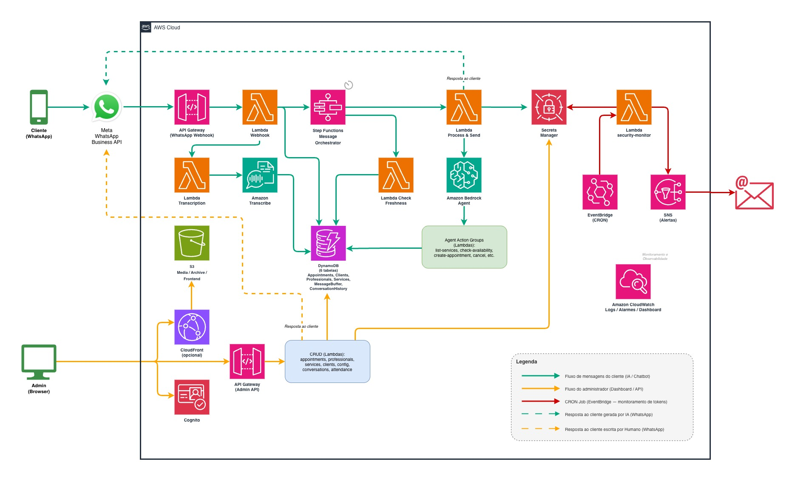

# Agendente — Assistente de Agendamento via WhatsApp com IA Generativa Sem Servidor na AWS

O **Agendente** é um projeto didático que demonstra como construir um assistente virtual de agendamento integrado ao WhatsApp, utilizando preferencialmente serviços **serverless** da AWS com foco em **baixo custo operacional**. O assistente conversa com clientes em linguagem natural (texto e áudio), interpreta intenções via **Amazon Bedrock** (LLM), e executa ações reais — como consultar disponibilidade, criar e cancelar agendamentos — tudo de forma autônoma, sem menus pré-definidos. O cenário de exemplo é uma barbearia, mas a arquitetura é white-label e pode ser adaptada para qualquer estabelecimento baseado em agendamento (petshop, consultório, estúdio, etc.).

## Visão Geral da Arquitetura

O diagrama abaixo apresenta a arquitetura de solução do projeto. As cores das setas representam os diferentes fluxos de dados:

- **Fluxo verde** — caminho das mensagens enviadas por clientes ao chatbot de agendamentos, processadas por IA
- **Fluxo laranja** — acesso dos administradores ao dashboard para consultar mensagens, agendamentos e gerenciar o sistema
- **Fluxo vermelho** — CRON job do Amazon EventBridge, responsável por monitorar a validade de tokens e notificar administradores
- **Linhas pontilhadas** — respostas enviadas de volta ao cliente via WhatsApp

O Amazon CloudWatch suporta o monitoramento e a observabilidade de toda a stack.



## Sobre o Projeto

### Objetivo Didático

O objetivo principal é **ensinar serviços serverless da AWS** através de um exemplo prático e funcional de IA Generativa. Por isso, a arquitetura pode conter elementos que, em um projeto real, seriam considerados exagero ou desnecessários — como o uso de Step Functions para orquestração que poderia ser feita em código puro, ou AppConfig para configurações que caberiam em variáveis de ambiente. Aqui, o propósito é **apresentar e exercitar o maior número possível de serviços AWS**, não construir uma stack performática ou mais enxuta possível.

Este projeto acompanha o curso [Inteligência Artificial Sem Servidor na AWS](https://www.udemy.com/course/inteligencia-artificial-sem-servidor-na-aws/?referralCode=D8B698362F72D8C8237D) na Udemy, ministrado em português brasileiro.

## ⚠️ Aviso Importante

**Este projeto foi gerado via Vibe Coding** (desenvolvimento assistido por IA). Isso significa que:

- O código **não é confiável para uso em produção**
- Assuma que o projeto **contém falhas de segurança**
- Não confie cegamente em nenhuma parte do código sem revisão própria
- Use como **ponto de partida e inspiração**, nunca como solução pronta

**O autor não se responsabiliza** por qualquer dano, custo, falha de segurança ou problema decorrente do uso deste código. Ao utilizar este projeto, você aceita total responsabilidade.

## Política de Privacidade (WhatsApp / Meta)

A Meta exige uma URL pública de política de privacidade para apps que usam a WhatsApp Business API. Este projeto oferece duas opções:

| Opção | URL | Quando usar |
|-------|-----|-------------|
| Frontend (Angular) | `https://SEU_DOMINIO/privacy-policy` | Enquanto a infraestrutura estiver ativa na AWS |
| GitHub (Markdown) | `https://github.com/SEU_USUARIO/SEU_REPO/blob/main/docs/PRIVACY_POLICY.md` | Sempre disponível, mesmo após destruir a infra |

> **Dica:** após fazer o fork, a URL do GitHub é a opção mais resiliente — não depende de infra rodando e continua acessível mesmo após um `terraform destroy`.

## Licença e Uso Livre

Este projeto é distribuído sob a [Licença MIT](./LICENSE). Você é livre para:

- Clonar, estudar e modificar o código
- Usar como base para seus próprios projetos
- Criar produtos comerciais derivados deste código

Não é necessário ser aluno do curso. Não é necessário pedir permissão. Faça bom uso.

## Arquitetura

### Serviços AWS Utilizados

| Camada | Serviços |
|--------|----------|
| API | API Gateway (REST) com mTLS + Cognito JWT |
| Compute | Lambda (Python 3.13), Step Functions |
| IA | Bedrock (Agent + Action Groups), Transcribe |
| Dados | DynamoDB (6 tabelas), S3 (frontend, mídia, arquivo) |
| Configuração | AppConfig, SSM Parameters, Secrets Manager |
| Autenticação | Cognito (User Pool com grupos admin/regular) |
| Observabilidade | CloudWatch (dashboard, alarmes, logs), X-Ray, SNS |
| Agendamento | EventBridge (CRON) |
| Filas | SQS (com DLQ) |
| DNS/CDN | Route 53, CloudFront (opcional), ACM |
| IaC | Terraform |

### Fluxo Principal

1. Cliente envia mensagem no WhatsApp
2. Meta API → API Gateway (com mTLS opcional) → Lambda webhook
3. Step Functions orquestra: verifica horário → aguarda inatividade → transcreve áudio (se houver) → consolida mensagens → invoca Bedrock Agent
4. Bedrock Agent interpreta a intenção e chama Action Groups (Lambdas) para consultar/criar agendamentos no DynamoDB
5. Resposta é enviada de volta ao WhatsApp

### Frontend (Dashboard do Estabelecimento)

Aplicação Angular para o dono do estabelecimento gerenciar:

- Calendário de agendamentos
- Cadastro de profissionais e serviços
- Lista de clientes e conversas
- Configurações do sistema (horário de funcionamento, modo agente IA on/off)
- Painel de atendimento WhatsApp

## Estrutura do Repositório

```
├── backend/
│   ├── src/lambda/          # ~25 Lambda Functions (Python)
│   │   ├── agent_*          # Action Groups do Bedrock Agent
│   │   ├── conversation_*   # Processamento de mensagens WhatsApp
│   │   ├── crud_*           # CRUD para o dashboard admin
│   │   └── scheduled_*      # Tarefas agendadas (CRON)
│   └── terraform/
│       ├── infrastructure/  # Módulos Terraform (recursos AWS)
│       └── environments/    # Configuração por ambiente (dev, prod)
├── frontend/                # Angular 21 (dashboard do estabelecimento)
└── docs/                    # Pontos-chave da arquitetura
```

## Documentação

A pasta `docs/` contém documentos com pontos-chave da arquitetura.

Esses documentos também servem como contexto para guiar IAs na geração e manutenção de código. Este projeto foi construído dessa forma: primeiro escrevi especificações em Markdown descrevendo o que eu desejava, e depois usei IA para gerar o código a partir delas. Para expandir o projeto, recomendo o mesmo fluxo — escreva suas especificações na pasta `docs/` antes de pedir para a IA implementar.

## Quick Start

### Pré-requisitos

- Conta AWS com acesso ao Amazon Bedrock
- Terraform instalado
- Node.js e Angular CLI (para o frontend)
- Conta Meta Business com WhatsApp Business API configurada

### Deploy do Backend

```bash
cd backend/terraform/environments/dev

# Configurar variáveis
cp backend.hcl.example backend.hcl
cp terraform.tfvars.example terraform.tfvars
# Edite ambos os arquivos com seus valores

# Deploy
terraform init -backend-config=backend.hcl
terraform plan
terraform apply
```

### Setup do Frontend

O `terraform apply` já faz automaticamente o build e deploy do frontend para o S3. Ao executar o comando de deploy do backend, o Terraform:

1. Gera os arquivos `environment.localhost.ts` e `environment.aws.ts` com os valores reais (Cognito, API URL, etc.)
2. Executa `ng build --configuration=production`
3. Envia os arquivos para o bucket S3 do frontend via `aws s3 sync`

Isso acontece em todo `terraform apply` enquanto `frontend_deploy_enabled = true` (padrão). Para desabilitar o deploy automático, edite `backend/terraform/environments/dev/main.tf`:

```hcl
frontend_deploy_enabled = false
```

#### Teste local após deploy

Após o `terraform apply`, os arquivos de ambiente já estarão configurados. Para rodar localmente:

```bash
cd frontend
npm install
ng serve
```

O frontend estará disponível em `http://localhost:4200` usando as configurações de `environment.localhost.ts`.

#### Deploy manual (sem Terraform)

Se preferir configurar manualmente sem o deploy automático:

```bash
cd frontend
npm install

# Copiar e editar o arquivo de ambiente com os valores do terraform output
cp src/environments/environment.example.ts src/environments/environment.localhost.ts
cp src/environments/environment.example.ts src/environments/environment.aws.ts
# Edite ambos os arquivos com os valores exibidos no terraform output

# Build e deploy manual
ng build --configuration=production
aws s3 sync dist/agendente/browser s3://NOME_DO_BUCKET_FRONTEND --delete
```

## Custos

Este projeto foi desenhado para custo mínimo em ambientes de aprendizado, utilizando preferencialmente serviços com modelo pay-per-use ou on-demand. Ainda assim, **recursos AWS geram cobranças**. Monitore seus custos e destrua os recursos quando não estiver usando:

```bash
cd backend/terraform/environments/dev
terraform destroy
```

## Contribuições

Sugestões de melhorias são bem-vindas! Fique à vontade para fazer um fork do projeto e propor melhorias via Pull Request.

## Autor

Projeto criado por [Carlos Biagolini-Jr.](https://github.com/biagolini) como material de apoio para o curso [Inteligência Artificial Sem Servidor na AWS](https://www.udemy.com/course/inteligencia-artificial-sem-servidor-na-aws/?referralCode=D8B698362F72D8C8237D).

Boa parte dos códigos deste projeto foram criados via Vibe Coding, tendo como base conceitual artigos que publiquei sobre computação em nuvem, IA, serverless e segurança. Se você se interessa por esses temas, recomendo acompanhar:

- [Medium](https://medium.com/@biagolini) — artigos em inglês
- [AWS Community Builder](https://builder.aws.com/community/@cbiagolini) — artigos em português
