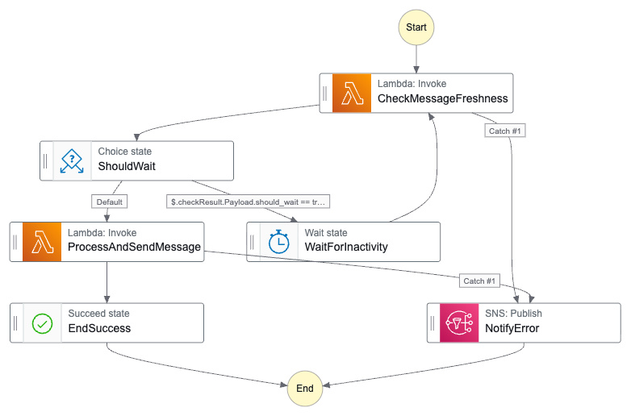

# Step Functions - Message Orchestrator

## Visão Geral

O projeto utiliza AWS Step Functions para orquestrar o processamento de mensagens recebidas via WhatsApp. A state machine **MessageOrchestrator** coordena o fluxo desde a recepção da mensagem até a resposta ao cliente, gerenciando espera por inatividade e tratamento de erros.

A definição da infraestrutura está em `backend/terraform/infrastructure/aws_step_functions.tf`.

---

## Fluxo de Execução

A state machine é iniciada pela Lambda `conversation_webhook` quando uma nova mensagem chega do WhatsApp.

### 1. CheckMessageFreshness

Invoca a Lambda `conversation_check_freshness` para verificar se o usuário ainda está digitando (enviando mensagens em sequência). Retorna se deve aguardar mais mensagens ou prosseguir com o processamento.

### 2. ShouldWait (Choice)

Avalia o resultado do passo anterior:
- **should_wait = true** → vai para `WaitForInactivity` (o usuário ainda está digitando)
- **should_wait = false** → vai para `ProcessAndSendMessage` (pode processar)

### 3. WaitForInactivity

Aguarda o número de segundos retornado por `CheckMessageFreshness` (configurável via AppConfig: `inactivity_threshold_seconds`). Após a espera, volta para `CheckMessageFreshness` para verificar novamente.

### 4. ProcessAndSendMessage

Invoca a Lambda `conversation_process_and_send` que:
- Consolida as mensagens pendentes do buffer
- Transcreve áudios (se habilitado)
- Invoca o Bedrock Agent para interpretar a intenção
- Envia a resposta de volta ao WhatsApp

Após o processamento, a execução finaliza com sucesso (`EndSuccess`). Em caso de falha, o fluxo é redirecionado para `NotifyError`.

### 5. NotifyError

Em caso de falha em qualquer etapa, publica uma notificação no SNS topic de alertas com detalhes do erro, user_id e o estado que falhou.

---

## Configurações

| Parâmetro | Valor | Descrição |
|-----------|-------|-----------|
| TimeoutSeconds | 600 | Timeout máximo da execução (10 minutos) |
| Retry MaxAttempts | 2 | Tentativas de retry em caso de falha nas Lambdas |
| Retry BackoffRate | 2.0 | Multiplicador de espera entre retries |
| Logs | ALL | Todos os eventos são logados no CloudWatch |
